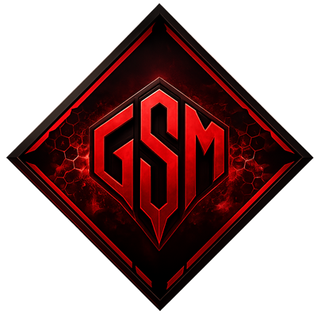



  

<h1 align="center">Games Server Manager</h1>

**Games Server Manager (GSM)** is a terminal application for installing, configuring
and running dedicated **Source Engine** game servers — starting with **Left 4 Dead 2**,
with more games planned. It puts the whole lifecycle of a dedicated server behind a
clean, keyboard-driven text interface: no manual config editing, no remembering
SteamCMD commands, no scattered files to babysit.

> ⚠️ **Beta** — This is an early test build. Features and behaviour may still change,
> and bugs are expected. Feedback is very welcome.

---

## Screenshots

| Splash screen | Main menu | Server menu |
|---|---|---|
|  |  |  |

---

## What it does

- **Guided server creation.** A step-by-step wizard installs a dedicated server
  through SteamCMD and walks you through the essentials — game, server name,
  network details, starting map and game mode — so a working server is only a
  few prompts away.
- **SteamCMD, handled for you.** Installs and updates server files in the
  background with live progress, and can resume an interrupted install instead
  of starting over.
- **One place for every server.** All your servers live in a single registry and
  are listed with their status at a glance, so you always know what is installed,
  what is running and what needs attention.
- **Start, stop and monitor.** Launch a server and keep an eye on it without
  leaving the tool.
- **Portable by design.** Everything GSM needs is created next to the executable,
  so a server setup can be moved or backed up by copying one folder.

> More capabilities (remote console, mod management, and additional games) are on
> the roadmap.

---

## Download & install

1. Download `gsm.exe` from the [**Releases**](../../releases/latest) page.
   *(That is the only file you need — ignore the auto-generated "Source code"
   archives; they do not contain the application source.)*
2. Place `gsm.exe` in its **own dedicated folder** — not inside `Program Files`,
   and ideally not on your Desktop. A path like `C:\GameServers\GSM\` is perfect.
3. Run it.

On first launch GSM creates everything it needs right next to itself:

| Folder       | Contents                                  |
|--------------|-------------------------------------------|
| `config`     | Your settings and the server registry     |
| `servers`    | The installed dedicated servers           |
| `downloads`  | SteamCMD and downloaded files             |
| `logs`       | Session logs                              |

Because everything lives in that one folder, GSM is fully **portable**: to move it
to another disk or machine, or to back it up, just copy the whole folder.

---

## First run

- You will be asked to pick a **language**, then dropped into the main menu.
- From there, start the **create-server wizard** to install your first server.
- The executable is **unsigned**, so Windows SmartScreen may show a warning on the
  first launch. Choose **More info → Run anyway**.

---

## Requirements

- **Windows 10 / 11, 64-bit**
- An **internet connection** (SteamCMD downloads the server files)
- Enough free disk space for the game server you install (a few GB per server)

---

## Updates

GSM checks for new versions on startup. When an update is available it lets you
know and points you back to the [Releases](../../releases/latest) page, where you
can download the newer `gsm.exe` and replace the old one — your `config`, `servers`
and other data are kept.

---

## Feedback

This is a beta: if something breaks, behaves oddly, or you have a suggestion,
please open an issue on this repository. Thanks for testing!