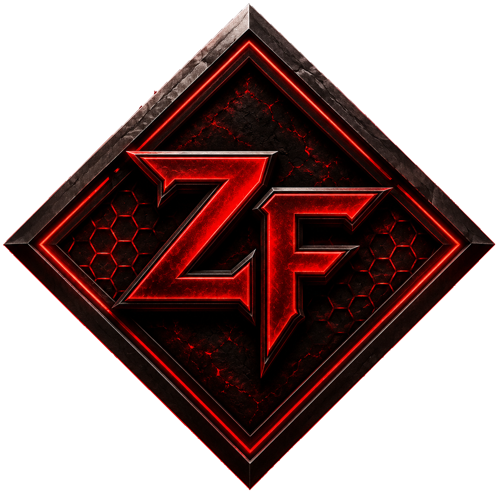

  

  

**Zombie Foundry** is a terminal application for installing, configuring
and running dedicated **Source Engine** game servers — starting with **Left 4 Dead 2**,
with more games planned. It puts the whole lifecycle of a dedicated server behind a
clean, keyboard-driven text interface: no manual config editing, no remembering
SteamCMD commands, no scattered files to babysit.

> ⚠️ **Beta** — This is an early test build. Features and behaviour may still change,
> and bugs are expected. Feedback is very welcome.

> 💰 **Not free software.** Zombie Foundry includes a **7-day free trial** (just an
> email address, no credit card). After the trial, continued use requires a license —
> see the store: [smallsoftwarehouse.gumroad.com](https://smallsoftwarehouse.gumroad.com/).
> Right now only **Early Access** is being actively promoted; the full plan lineup is
> on the store page.

---

## Why a terminal app, not a GUI?

Because a dedicated server is something you run in the background and rarely
stare at — a terminal window is the natural fit, the same place SteamCMD and
the server console already live. A TUI keeps the whole thing lightweight and
fast to start, without the overhead a full graphical framework would add for
what is, underneath, a sequence of forms and status lists. A graphical
version isn't ruled out — it will happen if it's actually needed.

---

## Screenshots

| Splash screen | Main menu | Server menu |
|---|---|---|
|  |  |  |

---

## What it does

- **Guided server creation.** A step-by-step wizard installs a dedicated server
  through SteamCMD and walks you through the essentials — game, server name,
  network details, starting map and game mode — so a working server is only a
  few prompts away.
- **SteamCMD, handled for you.** Installs and updates server files in the
  background with live progress, and can resume an interrupted install instead
  of starting over.
- **One place for every server.** All your servers live in a single registry and
  are listed with their status at a glance, so you always know what is installed,
  what is running and what needs attention.
- **Start, stop and monitor.** Launch a server and keep an eye on it without
  leaving the tool.
- **Portable by design.** Everything Zombie Foundry needs is created next to the
  executable, so a server setup can be moved or backed up by copying one folder.
  Note: your license is tied to this specific computer and folder, so moving it
  elsewhere requires re-authorizing it first (the in-app **F2** transfer, from the
  license screen) — otherwise the moved copy won't validate.

> More capabilities (remote console, mod management, and additional games) are on
> the roadmap.

---

## Download & install

1. Download `zombiefoundry.exe` from the [**Releases**](../../releases/latest) page.
   *(That is the only file you need — ignore the auto-generated "Source code"
   archives; they do not contain the application source.)*
2. Place `zombiefoundry.exe` in its **own dedicated folder** — not inside `Program Files`,
   and ideally not on your Desktop. A path like `C:\GameServers\ZombieFoundry\` is perfect.
3. Run it.

On first launch Zombie Foundry creates everything it needs right next to itself:

| Folder       | Contents                                  |
|--------------|-------------------------------------------|
| `config`     | Your settings and the server registry     |
| `servers`    | The installed dedicated servers           |
| `downloads`  | SteamCMD and downloaded files             |
| `logs`       | Session logs                              |

---

## First run

- You will be asked to pick a **language**, then to either enter a **license key**
  (if you already bought one) or an **email address** to start your **7-day free
  trial**. After that you're dropped into the main menu.
- From there, start the **create-server wizard** to install your first server.
- The executable is **unsigned**, so Windows SmartScreen may show a warning on the
  first launch. Choose **More info → Run anyway**.
- **Curious about the flag?** We ran the current release through VirusTotal
  ourselves: **69/71 engines report it clean**. The 2 that don't (Bkav Pro,
  Trapmine) use generic heuristic/ML labels, not a named malware signature —
  and the sandbox behavior report shows no actual malicious detection.
  Microsoft Defender flagged an earlier scan too, but a re-analysis has since
  cleared it. See the full report and judge for yourself:
  [VirusTotal report](https://www.virustotal.com/gui/file/ae6bbb5cac51ff03f64500017b07ee4f9c6430cbbf90bf9504dfec07a0b34723/behavior).
  We've filed false-positive reports with the remaining two vendors, but
  we're not waiting on their replies to be upfront about this — as a small
  independent project we may just not be a priority for them to review
  quickly.

---

## Requirements

- **Windows 10 / 11, 64-bit**
- An **internet connection**
- Enough free disk space for the game server you install (a few GB per server)

---

## Updates

Zombie Foundry checks for new versions on startup. When an update is available, it can
update itself: download the new build, verify it, and swap it in with a single
keypress — no manual download, no replacing files by hand. Your `config`, `servers`
and other data are kept. If self-update isn't available for a given release, the tool
falls back to pointing you at the [Releases](../../releases/latest) page instead.

---

## Feedback

This is a beta: if something breaks, behaves oddly, or you have a suggestion,
please open an issue on this repository. Thanks for testing!
